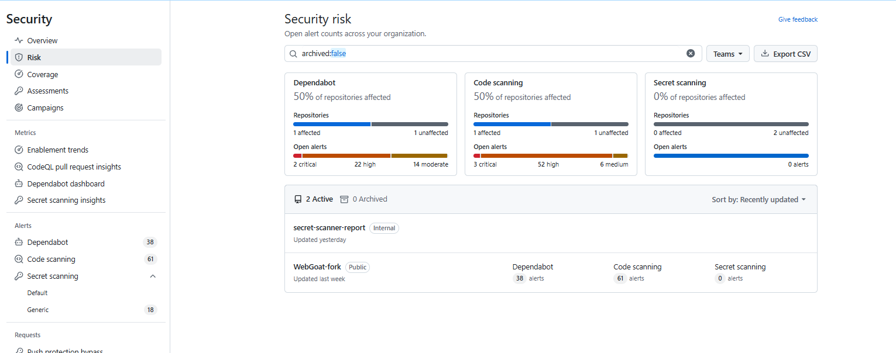
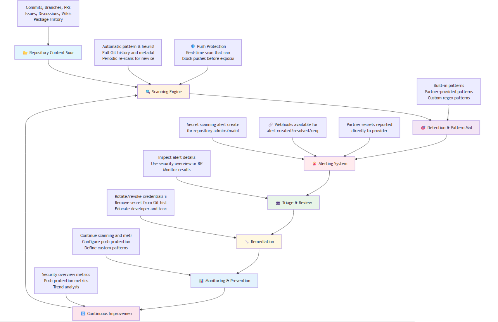

# GHAS Secret Scanning Adoption Playbook

**Version:** 1.0  
**Last Updated:** December 16, 2025  
**Owner:** Information Security Team  
**Review Cycle:** Quarterly  
**Scope:** Security Leadership, Security Engineers, Development Teams  
**Objective:** Provide a comprehensive roadmap for enterprise adoption and governance of GHAS Secret Scanning.

## Executive Summary

This playbook provides a comprehensive roadmap for enterprise-wide adoption of GitHub Advanced Security (GHAS) Secret Scanning. It outlines the strategic approach, implementation phases, organizational structure, and governance framework required for successful deployment across HCL.

---

## 1. Overview 

### 1.1. Business Case

**Problem Statement:**  
Hardcoded secrets in source code repositories pose critical security risks including:
- Unauthorized access to production systems and data
- Potential data breaches and regulatory violations
- Financial losses from compromised cloud infrastructure
- Reputational damage from security incidents

**Solution:**  
GitHub Advanced Security Secret Scanning provides automated detection, prevention, and remediation capabilities to eliminate credential exposure risks across the enterprise.

**Expected Benefits:**
- 🔒 **Risk Reduction:** 90%+ reduction in exposed credentials within 6 months
- ⚡ **Prevention:** Real-time blocking of secret commits via Push protection
- 📊 **Visibility:** Centralized monitoring of secret exposure across all repositories
- ⚖️ **Compliance:** Enhanced security posture for regulatory requirements
- 💰 **Cost Avoidance:** Prevention of security incidents and breach costs

### 1.2. Scope and Status

#### Overall Scope
- **In Scope:**
   - All repositories within HCL enterprise
   - Native secret scanning for 200+ partner patterns
   - Custom pattern development for internal secrets
   - Push protection implementation
   - Training and enablement for all development teams

- **Out of Scope:**
   - Third-party repositories outside HCL 
   - Non-Git version control systems
   - Legacy systems not using GitHub

- **Scale Metrics:**
   - **Organizations:** [Number] GitHub organizations
   - **Repositories:** [Number] total repositories
   - **Developers:** [Number] active developers
   - **Teams:** [Number] development teams
   

#### Current State
- **Status:**  
  - Secret Scanning is enabled for all repositories in the HCL enterprise
  - Push protection is disabled (but can be enabled with enterprise controls)
  - No pilot phase; Enterprise wide rollout is complete
  - Scanning covers: code repositories, issues, pull requests, discussions, wikis, and secret gists
  - Focus on remediation, best practices, and training as per SOW

- **Objectives:**  
  - Rapidly reduce exposed secrets and false positives.
  - Standardize remediation process and notification workflows.
  - Train all stakeholders (2hrs- Security, 4hrs- Developers).

---

## 2. Key Activities & Deliverables

### Inventory Report
- Identify all organizations and repositories.
- Use custom script to get Enterprise-level Secret Scanning Alerts.
- Categorize detected secrets (type, count, false positives).

### Documentation of Current State
- Document number of exposed secrets, types, and false positive rates.

### Remediation SOPs
- Build SOPs for secret remediation (revocation, replacement, removal from history).
- Provide clear guidance for revoking and replacing secrets.
- Use GitHub Actions/scripts for admin notifications and tracking timelines.

### Best Practices Documentation
- Recommend secret management best practices for all teams.
- Enforce push protection and secret scanning policies at the enterprise level.- Implement advanced features:
  - **Validity Checks**: Prioritize alerts by identifying active vs. inactive secrets
  - **Non-Provider Patterns**: Detect generic secrets like connection strings and private keys
  - **Copilot Secret Scanning**: AI-powered detection of unstructured secrets and regex generation
  - **Custom Patterns**: Organization-specific secret detection patterns
  - **Delegated Bypass**: Controlled push protection bypass with reviewer approval
### Notifications
- Design notification workflows using GitHub Actions and scripts.
- Ensure timely alerting and tracking of remediation progress.

### Executive Dashboard
- Set up dashboards in GitHub Advanced Security.
- Guide teams on using REST API for reporting and tracking.

### Training
- **Security Team:** 2-hour focused session on alert triage, remediation validation, and policy enforcement.
- **Development Teams:** 4-hour session on secret remediation, best practices, and prevention.

### Support
- Provide hands-on support for selected teams to demonstrate remediation practices.

---

## 3. Roles & Responsibilities

| Role                | Responsibilities                                                                 |
|---------------------|----------------------------------------------------------------------------------|
| Security Team       | Owns program, validates remediation, manages exceptions, attend 2hr training   |
| Developers          | Remediate secrets, follow best practices, attend 4hr training                    |
| Admins/Champions    | Support teams, ensure compliance, act as first responders, attend 2hr training                        |

---

## 4. Remediation Workflow

1. **Detection:**  
   - Alerts generated by GHAS (already enabled).

2. **Triage:**  
   - Assess if secret is valid/active or a false positive.
   - Assign to responsible developer/team.

3. **Remediation:**  
   - Revoke/rotate secret with provider.
   - Remove secret from code and history (use git-filter-repo or similar).
   - Replace with secure storage (GitHub Secrets, Vault, etc.).

4. **Validation & Closure:**  
   - Confirm secret is revoked and removed.
   - Test application functionality.
   - Close alert with documentation.
   - Follow detailed closure reason steps and responsibilities as outlined in the Security Team SOP (e.g., Revoked, False Positive, Used in Tests, Risk Accepted).

5. **Notification:**  
   - Use automated workflows to notify admins and track timelines.

---

## 5. Best Practices

- Never hardcode secrets.
- Use `.gitignore` for sensitive files.
- Enable Push protection with bypass controls:
  - "Used in tests" → Creates closed alert (resolved as test)
  - "False positive" → Creates closed alert (resolved as false positive)  
  - "Fix later" → Creates open alert requiring remediation
- Consider delegated bypass for enterprise control over push protection overrides
- Use pre-commit hooks (gitleaks, talisman) as additional protection
- Regularly rotate credentials
- Document and review all path exclusions
- Report incidents immediately
- Enable validity checks to prioritize active vs. inactive secrets
- Configure custom patterns for organization-specific secrets
- Handle all alert dismissals, exceptions, and bypasses according to the SOP’s documented process for review, approval, and documentation.

---

## 6. Metrics & Reporting

Metrics and reporting should be analysed at both the Organization and Enterprise levels:

- Track number of open/closed alerts, MTTR, false positive rate (see SOP section 4.5.1 for org-level, 4.5.2 for enterprise-level dashboards)
- Monitor validity check results (active vs. inactive secrets) using the appropriate dashboard
- Track push protection bypass patterns and reasons, and review trends at both org and enterprise scope
- Use GitHub Advanced Security dashboards and REST API for comprehensive reporting
- Generate security overview reports at both organization and enterprise level
- Monitor secret detection across expanded scope: repositories, issues, PRs, discussions, wikis
- Review metrics monthly with quarterly security assessments

---

## 7. Training Plan

- **Security Team:** 2hr session (alert triage, validation, policy).
- **Developers:** 4hr session (remediation, prevention, best practices).

---

## 8. Support

- Security team provides hands-on support for remediation.
- Use Slack/email/ticketing for queries.

---

**End of Document**
