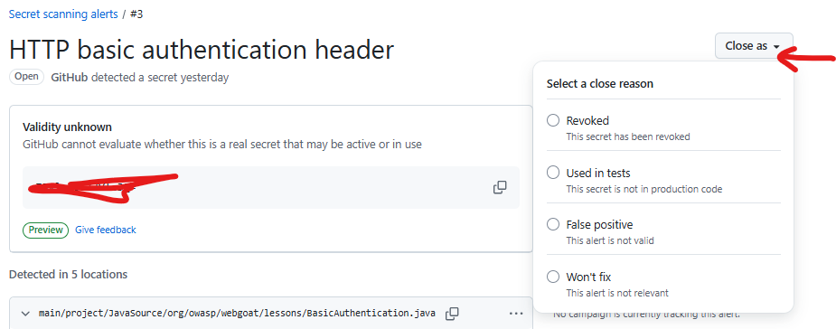

# SOP: Development Team – GHAS Secret scanning

**Version:** 1.0  
**Last Updated:** December 16, 2025  
**Owner:** Information Security Team  
**Review Cycle:** Quarterly  
**Scope:** 👨‍💻 Development Team  
**Objective:** 🎯 Prevent sensitive credentials (API keys, tokens, private keys) from being committed to the codebase and remediate inadvertent leaks.

---

## 🎯 1. Purpose
This SOP provides concise guidance for developers on responding to and preventing secret exposure in GitHub repositories, with secret scanning and push protection already enabled.

---
## 🔍 2. Overview
🛡️ GitHub secret scanning protects our code by identifying known secret formats (e.g., AWS keys, Stripe tokens). It operates in two modes:
1. 🚫 **Push protection:** Blocks you at the command line if you try to push code containing a secret.
2. 🚨 **Repository Scanning:** Alerts the security team if a secret is found in the current code/historical commit history.

---

## 📋 3. Responsibilities
- 🔧 Remediate secrets as soon as alerted
- ✅ Follow best practices for secret management
- 🎓 Attend 4-hour training on remediation and prevention
- 🤝 Use support channels for questions or issues

---

## 🚫 4. Workflow: Handling "Push protection" Blocks
⚠️ If you attempt to `git push` and GitHub detects a high-confidence secret, the push will be rejected to protect you.

### 🔍 Step 4.1: Analyze the Error
📝 Read the CLI error message. It will look like this:
```text
remote: error: GH006: Protected branch update failed for refs/heads/main.
remote: error: Found 1 secret(s) to protect:
remote: error:  - ALIBABA_CLOUD_ACCESS_KEY_ID: ...
remote: error:
remote: error: To push, remove the secret from your changes or...
```

<!-- Screenshot placeholder: CLI output and web link to bypass -->

<!-- TODO: Add screenshot showing the exact CLI message and the URL for bypassing in the web UI -->

### 🔧 Step 4.2: Remediation (The Right Way)
1. 🔍 Locate the file mentioned in the error log.
2. ❌ Remove the secret. Replace it with an environment variable reference (e.g., `process.env.API_KEY`) or a placeholder.
3. 📝 Amend the commit. Do not simply create a new commit on top of the bad one; the secret is still in the local history and will trigger the block again.

```bash
# After removing the secret from the file
git add <file>
git commit --amend
git push origin <branch-name>
```

### ⚠️ Step 4.3: Bypassing (Only in Emergencies)
🚑 If the finding is a False Positive (random string, dummy data) or used purely for testing:
1. 🌐 Navigate to the URL provided in the git error message.
2. 📋 Select the reason for bypassing:
   - 🧪 **Used for tests** → Creates closed alert
      * Ensure the secret is only present in test files or test data directories.
      * Use only dummy/test values that do not grant access to real systems.
      * Document the use of test secrets in the repository’s README or test policy.
      * Respond to Security team queries about the secret’s purpose.
   - ❌ **False positive** → Creates closed alert
      * Review the alert and provide context if the string is not a secret.
      * Suggest improvements to custom patterns if false positives are frequent.
   - ⏰ **Fix later** → Creates open alert requiring remediation (Not recommended)
      * Provide justification for deferring remediation.
      * Commit to a clear deadline for fixing the issue.
      * Address the secret by the agreed deadline.
   - ⚠️ **Risk accepted / Won't fix**
      * Only use if the key is low-impact/internal and risk is accepted by leadership.
      * Document the business or technical reason and notify Security team.
      * Follow the Security Team SOP for documentation and periodic review.
   - 🔄 **Revoked**
      * Use when the secret has been rotated/revoked and replaced securely.
      * Document the remediation steps and notify Security team.
      * Follow the Security Team SOP for closure documentation.
3. ✅ Once authorized via the UI, retry the `git push` within the allowed time window.

---

## 🚨 5. Workflow: Remediation of Leaked Secrets (Alerts)
⚡ If a secret bypasses protection or is found in history, you will be notified to fix it.

### 🔄 Step 5.1: Rotate the Secret (Crucial)
⚠️ Deleting the secret from code is not enough. If a key hits GitHub (even for a second), consider it compromised.
1. 🌐 Go to the service provider (e.g., AWS, Stripe, Azure).
2. 🚫 Revoke the compromised credential immediately.
3. ➕ Generate a new credential. A rotation policy is recommended.
4. 📝 Update your local `.env` file and the repository Secrets/Variables.

### 🧹 Step 5.2: Clean the History
🔄 Once the key is rotated:
1. ❌ Remove the code referencing the secret.
2. ⚙️ (Optional/Advanced) Rewrite git history using tools like BFG Repo-Cleaner or `git filter-repo` to scrub the old hash entirely from the `.git` folder.
3. 🧪 Test application functionality.
4. 📝 Close alert with documentation.

#### Step 5.2.3: Example
⚠️ WARNING: The following steps involve rewriting Git history. This is a destructive action. Coordinate with your team before force-pushing.

1. 📥 Clone a fresh copy of the repository:
   ```bash
   git clone --mirror https://github.com/org/repo.git
   cd repo.git
   ```

2. 🛠️ Use a history rewriting tool. We recommend git-filter-repo.
   - First, install it:
     ```bash
     pip3 install git-filter-repo
     ```
   - Create a `secrets.txt` file with the exact strings to remove (one per line):
     ```bash
     # Example secrets.txt content:
     AKIA2E4X5K6L7M8N9O0P
     sk-1234567890abcdefghijklmnop
     ```
   - Run the tool to replace/remove the secret strings:
     ```bash
     git filter-repo --replace-text /path/to/secrets.txt
     ```

3. 🚀 Force-push the changes:
   ```bash
   git push origin --force --all
   git push origin --force --tags
   ```

4. All collaborators will need to fetch and rebase their local branches.

### ✅ Step 5.3: Validation & Closure
- ✅ Confirm secret is revoked and removed
- 🔍 Use validity checks to determine if secret was active or inactive
- 📋 Select the appropriate closure reason (Revoked, False Positive, Used in Tests, Risk Accepted) and document your actions and rationale in the alert UI, following the Security Team SOP.
- 🤖 Automated workflows notify admins and track timelines

---

## 🚨 6. Workflow: Other Scenarios

### 🛑 Closing Alerts as "No Fix" or "False Positive"
If you determine the finding is not a real secret (test value, example, or benign):
1. **Login to GitHub and open the alert.**
2. **Document the reason:** Add a clear comment explaining why this is not a real secret (e.g., "test key used in CI, not production").
3. **Close the alert:** In the alert UI select the appropriate closure reason (False positive, Used in tests, Won't fix, Revoked, etc.) and submit your comment, following the Security Team SOP for documentation.



4. **Notify your team lead:** Inform your lead for transparency and auditability.
5. **Respond to Security team queries:** Be prepared to provide additional context or evidence if requested.

### 🆘 Need Help / Escalation (Developer)
If you're unsure how to rewrite history, revoke a credential, or handle an alert:
- Contact your Security Champion or file a ticket to the Security Team via Slack/email.
- Ask for a pair-programming session if necessary. The Security Team can assist with `git-filter-repo` or BFG usage and coordinate revocation with providers.
- Follow the escalation path outlined in the Security Team SOP if the issue involves production data, organizational risk, or requires leadership approval.

---

## ✅ 7. Best Practices
- 🚫 **Use .gitignore:** Ensure `.env`, `.pem`, `.key`, and `config.local` files are ignored globally
- 🔍 **Pre-commit Hooks:** Consider using pre-commit locally to scan for secrets before they leave your machine (gitleaks, talisman)
- 🌐 **Environment Variables:** Never hardcode credentials. Use a secrets manager (e.g., GitHub Actions Secrets, Vault) or environment variables
- ❌ Never hardcode secrets in code, issues, PRs, discussions, or wikis
- ✅ Leverage validity checks to prioritize remediation efforts
- ⚠️ Use push protection bypass responsibly - follow organizational policies
- 🔒 Store secrets securely (GitHub Secrets, Azure Key Vault, etc.)
- 🔄 Regularly rotate credentials
- 👀 Be aware that scanning covers: repositories, issues, pull requests, discussions, wikis, and secret gists
- 🚨 Report incidents immediately
- 📋 Follow delegated bypass procedures when required

 - 📋 When closing or bypassing alerts, always select and document the closure reason as per the Security Team SOP.
 - 📝 Provide clear justification and respond promptly to Security team queries regarding exceptions, bypasses, or alert closures.

---

## 🤝 8. Support
- 💬 Use Slack/email/ticketing for support
- 🔒 Security team provides hands-on help as needed

---

**End of Document**

