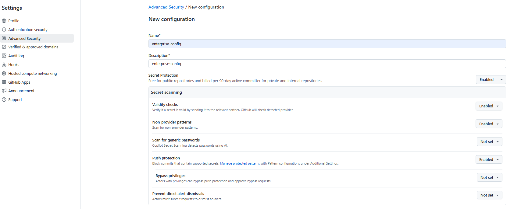
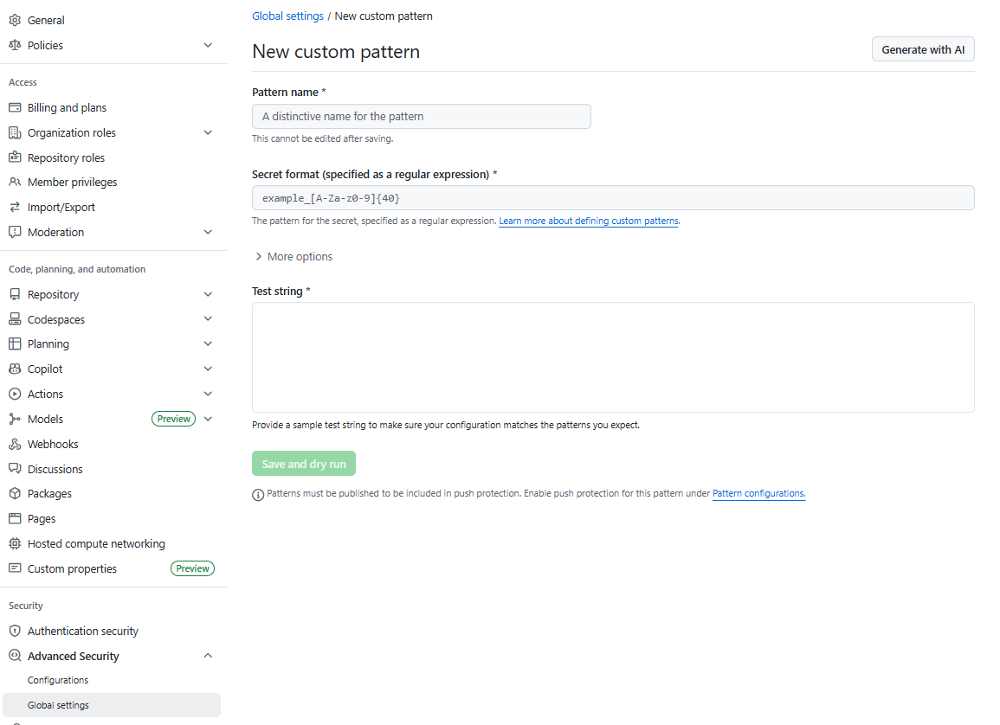
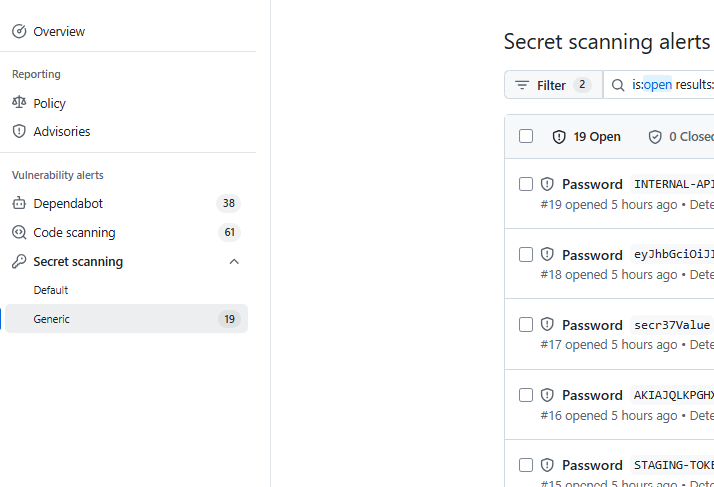
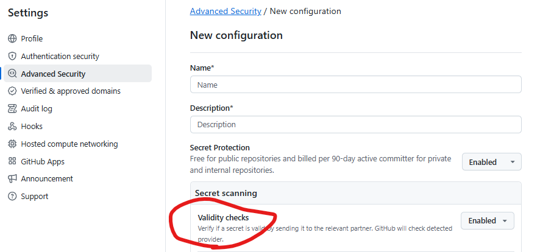
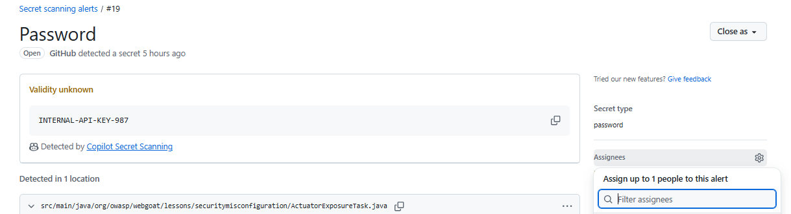
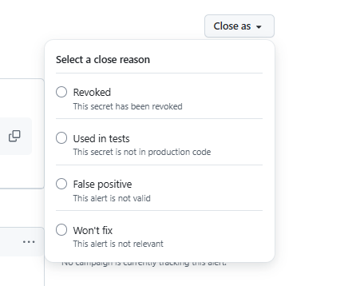
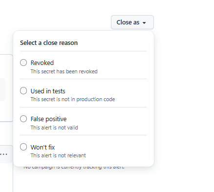
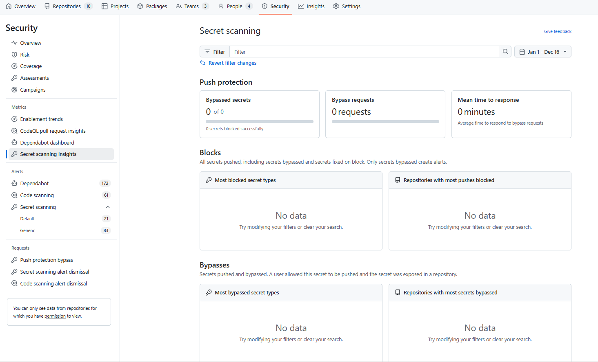

# SOP: Security Team – GHAS Secret scanning

**Version:** 1.0  
**Last Updated:** December 16, 2025  
**Owner:** Information Security Team  
**Review Cycle:** Quarterly  
**Scope:** 👥 Security Engineers & Repository Admins  
**Objective:** 🎯 Configure, monitor, and triage secret scanning alerts across the organization or enterprise.

---

## 🎯 1. Purpose
This SOP outlines the Security Team’s responsibilities and procedures for managing GHAS secret scanning in an enterprise where scanning and push protection are already enabled.

---

## 📋 2. Responsibilities
- 🛡️ Own the secret scanning program and validate all remediation actions
- ⚙️ Manage exceptions and path exclusions
- 🎓 Deliver 2-hour training to Security and Admin teams
- 🤝 Provide hands-on support for remediation
- 📊 Maintain dashboards and reporting

---

## ⚙️ 3. Configuration Management

### 🔧 3.1 Enabling Secret Scanning
Secret scanning must be enabled at the repository or organization level.
1. 🌐 Navigate to **Settings** > **Code security and analysis**.
2. 🔒 **GitHub Advanced Security**: Set to "Enabled".
3. 🔍 **Secret scanning**: Set to "Enabled".
4. 🛡️ **Push protection**: Set to "Enabled". ("disabled" as
   * ⚠️ *Note:* Push protection is critical as it prevents leaks *before* they enter the commit history.

### 🎨 3.2 Defining Custom Patterns
For internal credential formats (e.g., internal company tokens) not covered by GitHub's partner program:
1. 🌐 Navigate to **Settings** > **Code security** > **Global settings** (Enterprise) or Repo Settings.
2. ➕ Select **Custom patterns** > **New pattern**.
3. 📝 Define the Regex for the secret format.
4. 🧪 **Dry Run:** Always run a "Dry run" against selected repositories to verify noise levels before publishing the pattern.

---

## 🔄 4. Daily Operations

### 🚨 4.1. Alert Triage & Assignment

#### 👀 4.1.1 Monitoring Alerts
🌐 Review the **Security** tab > **Secret scanning** on a regular cadence (Daily/Weekly). The "Security Overview" dashboard provides a high-level view of open alerts.
- 🔍 Monitor new GHAS alerts across all sources: repositories, issues, PRs, discussions, wikis, secret gists
- ✅ Use validity checks to identify active vs. inactive secrets
- 🤖 Leverage AI-powered Copilot secret scanning for generic secret detection
- 🎨 Configure custom patterns for organization-specific secrets

#### ✅ 4.1.2 Verifying Validity
🤖 GitHub automatically checks the validity of secrets for supported partners (e.g., GitHub tokens, AWS, Slack). Look for the validity status badge:
* 🔴 **Active:** The token is live and exploitable. **Priority: Critical.**
* ⚫ **Inactive:** The token matches the pattern but is revoked/expired.
* ❓ **Unknown:** GitHub cannot verify status (requires manual check).

#### 📋 4.1.3 Assignment & Prioritization
- 👤 Assign alerts to responsible developer/team
- ⚡ Prioritize remediation for active/critical secrets

### 🔧 4.2. Remediation Validation
⚠️ When a valid secret is identified:
1. 👤 **Identify the User:** Check the commit author in the alert view.
2. 📞 **Contact:** Reach out to the developer immediately.
3. 🔄 **Verify Revocation:** Ensure the developer has revoked the key at the provider level. *Removing code is insufficient remediation.*
4. 📋 **Audit Logs:** If the key was "Active," check logs for that specific service to look for unauthorized access during the exposure window.
5. ✅ **Validate secure replacement:** Confirm usage of GitHub Secrets, Vault, etc.
6. 📝 **Close alert with documentation:** Document remediation actions taken.

### ❌ 4.3. Closing Alerts
🧹 Admins must maintain a clean backlog by closing processed alerts.

#### 📋 Closure Reasons:
* 🔄 **Revoked:** The developer has rotated the key and the old one is dead. (Most common/Desired state).
    1. Verify that the secret has been revoked/rotated at the provider.
    2. Confirm the secret is no longer present in the codebase.
    3. Check for secure replacement and proper storage of the new secret.
    4. Review audit logs for any unauthorized access during the exposure window.
    5. Document the closure and remediation actions.
* ❌ **False positive:** The pattern matched a random string/hash that is not a credential.
    1. Examine the detected string and its code context.
    2. Compare the string against the intended secret pattern/regex.
    3. Determine if the string is a random value, hash, or non-secret data.
    4. Refine the custom pattern if needed to reduce noise.
    5. Document the analysis and update the pattern if necessary.
* 🧪 **Used in tests:** The secret is a known dummy key used specifically for test suites.
    1. Review the file and code context where the secret was detected.
    2. Confirm the secret is a known dummy/test value and not a real credential.
    3. Validate that test secret usage aligns with policy.
    4. Document the review and rationale for accepting the test secret.
* ⚠️ **Wontfix / Risk accepted:** The key is low-impact/internal only, and leadership has accepted the exposure risk.
    1. Assess the risk and impact of leaving the secret unremediated.
    2. Confirm that the risk acceptance is approved by appropriate leadership.
    3. Document the risk acceptance, including rationale and approver.
    4. Periodically review accepted risks for any changes in impact or policy.

### 🚫 4.4. Exception & Bypass Management
- ✅ Review and approve/deny path exclusions and bypasses
- 👥 Manage delegated bypass for push protection with designated reviewers
- 🎨 Configure non-provider patterns for generic secret detection
- 📝 Document all exceptions and review monthly
- 🛡️ Ensure bypass reasons align with security policies:
  * 🧪 "Used in tests" → Verify legitimate test usage
    1. Review the file and code context where the secret was detected.
    2. Confirm the secret is a known dummy/test value and not a real credential.
    3. Validate that test secret usage aligns with policy.
    4. Document the review and rationale for accepting the test secret.
  * ❌ "False positive" → Validate pattern accuracy
    1. Examine the detected string and its code context.
    2. Compare the string against the secret pattern/regex.
    3. Determine if the string is a random value, hash, or non-secret data.
    4. Refine the custom pattern if needed to reduce noise.
    5. Document the analysis and update the pattern if necessary.
  * ⏰ "Fix later" → Track remediation timeline
    1. Record the reason for deferral and assess associated risk.
    2. Assign responsibility and set a remediation deadline.
    3. Track the alert in a dashboard or tracking system.
    4. Periodically review outstanding cases and escalate if deadlines are missed.

#### 🔍 4.4.1 Push protection oversight
👀 Admins should review bypassed push protections to ensure the feature is not being abused.
1. 🌐 Navigate to **Security Overview** (Org Level).
2. 🔍 Filter for "Secret scanning push protection."
3. 📋 Review reasons for bypass.
   * ⚡ *Action:* If developers are frequently bypassing "False Positives," investigate if Custom Patterns need tuning to reduce regex noise.
- 📊 Monitor push protection bypass patterns and reasons

### 📊 4.5. Metrics & Reporting

#### 4.5.1 Organization Level Dashboards & Reporting

**📈 Track open/closed alerts, MTTR, false positive rate**
1. Go to the organization’s Security Dashboard: `https://github.com/ORG-NAME/security`.
2. Select the **Secret scanning** tab to view the list of open and closed alerts.
3. Use filters to analyze alert status, severity, and repository.
4. Calculate Mean Time To Remediate (MTTR) using alert timestamps.
5. Review the false positive rate by comparing dismissed alerts with the "False positive" reason.

**✅ Monitor validity check results (active vs. inactive secrets)**
1. In the Security Dashboard, under **Secret scanning**, review the validity status badges (Active, Inactive, Unknown) for each alert.
2. Use the dashboard filters to focus on active secrets for prioritization.
3. Export alert data if needed for further analysis.

**📋 Report on push protection bypass patterns and effectiveness**
1. Navigate to the **Push Protection** section in the Security Dashboard or go to `https://github.com/ORG-NAME/security/push-protection`.
2. Review the list of bypassed push protection events and reasons provided by developers.
3. Track trends in bypass reasons and investigate frequent occurrences of "False positive" or "Used in tests".
4. Summarize findings in monthly security reports.

**🎨 Track custom pattern performance and coverage**
1. Go to **Settings** > **Code security and analysis** > **Custom patterns** in the organization or repository settings.
2. Review detection rates and noise levels for each custom pattern.
3. Adjust patterns as needed to improve accuracy and reduce false positives.
4. Document changes and their impact in the security report.

**🌐 Monitor alerts across expanded scope (repos, issues, PRs, discussions, wikis)**
1. In the Security Dashboard, use the scope filters to include all sources: repositories, issues, pull requests, discussions, and wikis.
2. Ensure that secret scanning is enabled for all relevant sources.
3. Periodically audit coverage and update scanning settings as needed.

**📊 Maintain executive dashboards and monthly reports**
1. Use the Security Overview dashboard (`https://github.com/ORG-NAME/security/overview`) for high-level metrics.
2. Export data from the Security Dashboard for use in executive presentations and monthly reports.
3. Highlight key trends, remediation progress, and outstanding risks.

**👀 Use security overview for organization-level visibility**
1. Regularly review the **Security Overview** dashboard for a summary of all security-related activity.
2. Share relevant insights with leadership and stakeholders.
3. Use the dashboard to identify areas needing additional focus or resources.

#### 4.5.2 Enterprise Level Dashboards & Reporting

**📈 Track enterprise-wide secret scanning metrics**
1. Go to the Enterprise Security Dashboard: `https://github.com/enterprises/ENTERPRISE-NAME/security`.
2. Review aggregated secret scanning alerts across all organizations in the enterprise.
3. Use filters to analyze trends, open/closed alerts, and MTTR at the enterprise level.

**✅ Monitor enterprise-wide validity check results**
1. In the Enterprise Security Dashboard, review validity status for all detected secrets across organizations.
2. Focus on active secrets for prioritized remediation.

**📋 Report on push protection and bypasses at enterprise level**
1. In the Enterprise Security Dashboard, access the Push Protection section for a consolidated view of bypass events across organizations.
2. Identify patterns and recurring issues that may require policy or pattern updates.

**🎨 Track custom pattern effectiveness enterprise-wide**
1. Review custom pattern detection rates and noise levels across all organizations.
2. Coordinate with org admins to tune patterns for better accuracy.

**🌐 Monitor coverage across all organizations and sources**
1. Ensure secret scanning is enabled for all organizations, repositories, and sources (issues, PRs, discussions, wikis).
2. Periodically audit enterprise-wide coverage and update settings as needed.

**📊 Maintain enterprise dashboards and executive reports**
1. Use the Enterprise Security Overview dashboard for high-level, cross-org metrics.
2. Export data for use in enterprise-wide executive presentations and reports.
3. Highlight trends, risks, and remediation progress at the enterprise level.

**👀 Use enterprise security overview for leadership visibility**
1. Regularly review the Enterprise Security Overview dashboard for a summary of all security-related activity across the enterprise.
2. Share insights with enterprise leadership and stakeholders.
3. Use the dashboard to identify systemic issues or areas needing additional focus.

### 🎓 4.6. Training & Support
- 📚 Deliver 2hr training covering:
  * 🚨 Alert triage with validity checks
  * 🛡️ Push protection and delegated bypass procedures
  * 🚀 Advanced features: Copilot scanning, custom patterns, non-provider patterns
  * 📋 Policy enforcement across expanded scanning scope
- 🤝 Provide support via Slack/email/ticketing
- 🌐 Guide teams on using REST API and dashboards
- 🤖 Train on AI-powered secret detection capabilities
- 🎨 Support custom pattern development and maintenance

---

## ✳️ Triage & Bulk Handling (From How-To Scenarios)

### 🔎 How to Triage and Assign Alerts (Security Manager)
1. **Login to GitHub Enterprise Security Dashboard.**
2. **View all open alerts:** Filter by repository, severity, or date to focus triage.
3. **Review alert details:** Check secret type, file path, commit author, and validity badge.
4. **Determine responsible team:** Use repository ownership, CODEOWNERS, or commit history to identify the correct team.
5. **Assign the alert:** Use GitHub's assignment feature and/or notify the team via Slack/email. Optionally create a ticket in the team's PM tool and link the alert.
6. **Track progress:** Monitor alert status and follow up if not resolved within SLA.

### 📦 Bulk Alert Handling (Security Team)
- **Export alerts:** Use the GitHub API to export alerts for bulk processing.
- **Group and prioritize:** Group by secret type and repository; prioritize high-severity/active secrets.
- **Batch assignment:** Use custom automation scripts or bulk assignment tools to assign alerts to teams in batches.
- **Monitor and report:** Track batch progress on a dashboard or shared spreadsheet; escalate persistent failures.

---

## 🚨 5. Escalation Path
* 👨‍💻 **Level 1 (Dev):** Rotate key, commit fix.
* 🔒 **Level 2 (Sec Ops):** Revoke key centrally (if owned by Org), trigger incident report if key had write-access to production data.
* ⚖️ **Level 3 (CISO/Legal):** Required if PII/PHI was accessed via the leaked credential.

---

## ✅ 6. Best Practices
- 🚫 Never approve exclusions for production secrets
- ⚙️ Configure delegated bypass with appropriate governance
- 🔄 Regularly review custom patterns and non-provider pattern effectiveness
- ✅ Leverage validity checks to focus on active threats
- 🤖 Monitor AI-powered detection accuracy and tune as needed
- 🌐 Ensure coverage across all scanning sources (repos, issues, PRs, discussions, wikis)
- 📋 Regularly review and update SOPs and best practices
- 📊 Ensure all incidents are reported and documented
- 📝 Maintain audit trails for all bypass approvals and exceptions

---

**End of Document**

