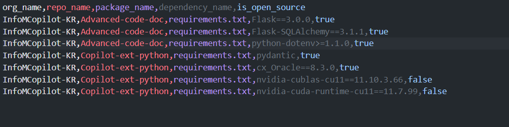

# GitHub Organization Package Fetcher

A Python utility to fetch and analyze package details from GitHub organizations and their repositories.

## Overview

## Features

- **GitHub App Authentication**: Secure authentication using GitHub Apps with higher rate limits
- **Comprehensive Package Detection**: Supports 13+ package manager types across multiple languages
- **GraphQL Integration**: Efficient data retrieval using GitHub's GraphQL API
- **Concurrent Processing**: Parallel processing of repositories and package files for better performance
- **Request Caching**: LRU cache implementation to reduce API calls and improve speed
- **Rate Limit Handling**: Automatic detection and handling of GitHub API rate limits
- **SSL Flexibility**: Configurable SSL verification for corporate environments
- **License Checking**: Built-in functionality to check package licenses for compliance
- **Error Resilience**: Comprehensive error handling with detailed logging
- **Progress Tracking**: Real-time progress updates during processing
- **Structured Output**: Well-organized CSV output with dependency and compliance tracking

## Prerequisites

- Python 3.6 or higher
- GitHub App with the following permissions:
  - `Contents: Read` (to access repository files)
  - `Metadata: Read` (for repository metadata)
  - `read:org` (to access organization details)
- GitHub App private key file
- GitHub App installation on target organizations

## Installation

1. Clone the repository
2. Install required dependencies:
```bash
pip install -r requirements.txt
```

## GitHub App Setup

Before using this tool, you need to create and configure a GitHub App:

1. **Create a GitHub App**:
   - Go to GitHub Settings > Developer settings > GitHub Apps
   - Click "New GitHub App"
   - Fill in the required information:
     - App name: Choose a unique name
     - Homepage URL: Your organization's URL or repository URL
     - Webhook URL: Not required, can be left blank or use a placeholder

2. **Set Permissions**:
   - Repository permissions:
     - Contents: Read
     - Metadata: Read
     - org: Read

3. **Generate and Download Private Key**:
   - After creating the app, generate a private key
   - Download the `.pem` file and store it securely
   - Note the App ID from the app settings page

4. **Install the App**:
   - Install the GitHub App on the organizations you want to analyze
   - You can install it on specific repositories or all repositories in the organization

5. **Configure Environment Variables**:
   - Set `GH_APP_ID` to your app's ID
   - Set `GH_PRIVATE_KEY_PATH` to the path of your downloaded `.pem` file

## Configuration

1. Create a `.env` file with the following variables:
```properties
# GitHub App Configuration
GH_APP_ID="your_GH_APP_ID"
GH_PRIVATE_KEY_PATH="path/to/your/private-key.pem"

# SSL Verification (set to false for corporate environments with self-signed certs)
VERIFY_SSL=true

# Input/Output Configuration
INPUT_CSV_PATH=organizations.csv
REPORTS_DIR=reports
```

2. Create an `organizations.csv` file with organization names:
```csv
org1,org2,org3
```

## Usage

Run the script:
```bash
python fetch-packages-org.py
```

## Output

The script generates CSV files in the `reports` directory for each processed organization. Each output file follows the naming pattern: `github_dependencies_{organization_name}_{timestamp}.csv`.

### Output File Structure

The CSV file contains the following columns:

- **org_name**: Name of the organization
- **repo_name**: Name of the repository
- **package_name**: Name of the package file (e.g., package.json, requirements.txt)
- **dependency_name**: Name of the dependency
- **is_open_source**: Boolean indicating if dependency has open source license

### Sample CSV Output



### Supported Package Types

The script automatically detects and parses the following package manager files:

- **Node.js**: `package.json`
- **Python**: `requirements.txt`, `Pipfile`, `pyproject.toml`
- **Java**: `pom.xml` (Maven), `build.gradle` (Gradle)
- **Rust**: `Cargo.toml`
- **Go**: `go.mod`
- **PHP**: `composer.json`
- **Ruby**: `Gemfile`
- **.NET**: `packages.config`, `*.csproj`
- **Dart/Flutter**: `pubspec.yaml`

### Output Details

1. **Organization and Repository Information**
   - Organization name for tracking across multiple orgs
   - Repository name for identifying the source of dependencies
   - Complete dependency mapping per repository

2. **Package Manager Detection**
   - Automatic detection of package manager files across 13+ languages
   - Precise identification of package file types
   - Support for both production and development dependencies

3. **Dependency Analysis**
   - Complete list of all dependencies found in each repository
   - License compliance checking for open source validation
   - Clean dependency names for easy analysis and reporting

4. **Compliance Tracking**
   - Built-in license checking against public package registries
   - Open source compliance indicators for each dependency
   - Support for multiple package registry APIs (PyPI, NPM, Maven, etc.)

### Use Cases

This CSV output is particularly useful for:
- **Dependency Auditing**: Track all dependencies across your organization
- **License Compliance**: Identify potentially problematic licenses
- **Security Analysis**: Feed data into security scanning tools
- **Inventory Management**: Maintain a complete software inventory
- **Cost Analysis**: Understand technology stack distribution

### Output Location

- Default: `./reports/github_dependencies_{org_name}_{timestamp}.csv`
- Configurable via `REPORTS_DIR` environment variable
- Timestamp format: `YYYYMMDD_HHMMSS`
- One CSV file per organization with all dependencies listed

## Troubleshooting Guide

### Common Issues and Solutions

1. **GitHub App Authentication Issues**
   - Error: `GitHub App credentials are required`
   - Solution: Ensure `GH_APP_ID` and `GH_PRIVATE_KEY_PATH` are set in your `.env` file
   - Verify the private key file path is correct and accessible

2. **Installation Not Found**
   - Error: `No GitHub App installation found for organization`
   - Solution: Install your GitHub App on the target organization
   - Verify the App has the necessary permissions (Contents: Read, Metadata: Read)

3. **SSL Certificate Verification Failed**
   - Error: `SSLError: [SSL: CERTIFICATE_VERIFY_FAILED]`
   - Solution: Set `VERIFY_SSL=false` in your `.env` file
   - Note: Only use this in corporate environments with self-signed certificates

4. **Rate Limiting**
   - Error: `403 Rate limit exceeded`
   - Solutions:
     - GitHub Apps have higher rate limits than personal tokens
     - The script includes automatic rate limit handling with retry logic
     - Wait for the rate limit reset (displayed in error messages)

5. **Organization Access Issues**
   - Error: `404 Not Found` when accessing organization
   - Solutions:
     - Verify the GitHub App is installed on the organization
     - Confirm organization name is correct in the CSV file
     - Ensure the App has organization-level permissions

6. **Any issues in identifying whether a package is open source**
   - Error: `Open source detection failed ` or `is_open_source` always shows true
   - Solutions:
     - Check and make necessary changes to `_check_package_license` function
     - Check if the dependencies have valid license information
     - Review logs for specific errors during license checking

7. **Memory Issues**
   - Error: `MemoryError` or script becomes unresponsive
   - Solutions:
     - The script uses concurrent processing with built-in limits
     - Large organizations are processed in batches automatically
     - Increase system memory if processing very large organizations

8. **CSV Generation Errors**
   - Error: `CSV file generation failed`
   - Solutions:
     - Check disk space and permissions for the output directory
     - Review logs for specific error messages during CSV generation
     - Ensure all required fields are present in the data

### Performance Optimization

1. **Built-in Optimizations**
   - Uses GraphQL for efficient repository and language data retrieval
   - Implements request caching with LRU cache (maxsize=1000)
   - Concurrent processing with ThreadPoolExecutor (3 workers for repos, 5 for package files)
   - Automatic rate limit handling with exponential backoff

2. **For Large Organizations**
   - Repositories are processed in parallel batches automatically
   - GraphQL pagination handles large repository lists efficiently
   - Memory usage is optimized with streaming CSV processing
   - Progress tracking shows real-time processing status

3. **GitHub App Benefits**
   - Higher rate limits compared to personal access tokens
   - More reliable authentication for enterprise environments
   - Better audit trail and permission management

## Logging and Monitoring

The script provides comprehensive logging and progress tracking:

- **Real-time Progress**: Shows current repository being processed with count (e.g., "Processing repository 5/20: repo-name")
- **Execution Summary**: Displays total execution time and statistics at completion
- **Error Handling**: Detailed error messages with context for troubleshooting
- **Rate Limit Monitoring**: Automatic detection and logging of rate limit status
- **SSL Warnings**: Notifications when SSL verification is disabled
- **File Generation**: Confirmation messages with full paths to generated CSV files

### Console Output Example:
```
Fetching package details for organization: example-org
Found 15 repositories
Processing repository 1/15: web-app
Processing repository 2/15: api-service
Processing repository 3/15: mobile-app
...
Fetching GitHub Packages...
Time taken: 45.32 seconds
Package dependencies saved to: ./reports/github_dependencies_example-org_20250729_100000.csv

Generated report files:
- ./reports/github_dependencies_example-org_20250729_100000.csv
```

## Support and Maintenance

For issues or enhancements:
1. Check the troubleshooting guide above
2. Verify configuration and permissions
3. Review logs for specific error messages
4. Submit detailed bug reports including:
   - Error messages
   - Configuration details
   - Organization size and context
